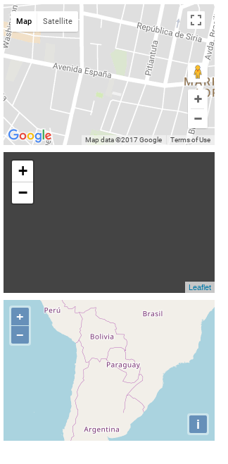

# MapGeneric
Is a micro library that abstract to the maps providers

Requisitos:
* Api Key Map Provider
* Include de map-generic.js in your html

## Test

### Leaflet
    var leaflet = new MapGeneric.Map(
      'leaflet', 
      document.getElementById('leaflet-map'), 
      {
        lat: -25.287724, 
        lng: -57.607870
      }, 
      //'ROADMAP'
    );
    leaflet.initialize();

### Google Maps
    var googleMap = new MapGeneric.Map(
      'google', 
      document.getElementById('google-map'), 
      {
        lat: -25.287724, 
        lng: -57.607870
      }, 
      'ROADMAP'
    );
    googleMap.initialize();
